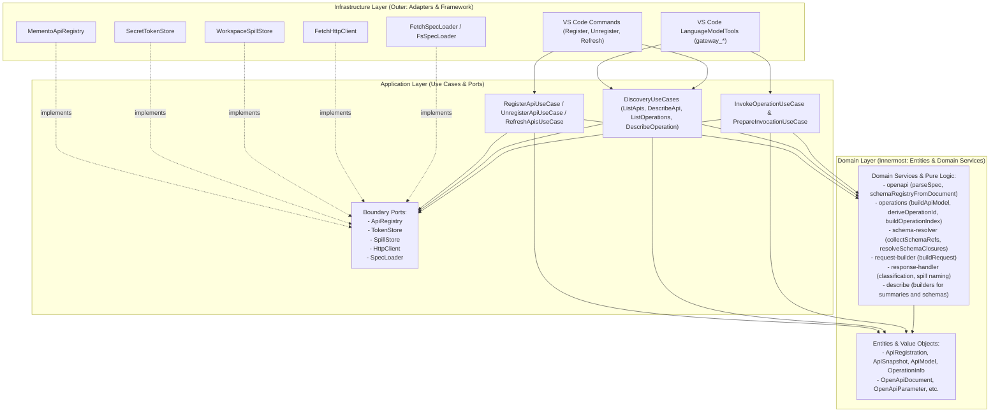

# Onion Architecture Migration Plan

## 1. Overview & Architecture Goals

The goal of this refactoring is to migrate the **OpenAPI Gateway for Chat** VS Code extension to a strict **Onion Architecture** (Clean / Ports & Adapters Architecture).

This establishes three clear layers:

1. **Domain Layer (`src/domain/`)**: Pure domain models, entities, and business logic (OpenAPI parsing and validation, operation ID derivation & grouping, `$ref` schema closure resolution, request building, response classification, and discovery DTO builders). Zero dependencies on external frameworks or the VS Code API.
2. **Application Layer (`src/application/`)**: Application use cases orchestrating domain services and boundary ports. All boundary interactions (persistence, secret storage, HTTP client execution, spill files, and spec loading) are modeled as pure TypeScript interfaces (no `I` prefix, e.g. `ApiRegistry`, `TokenStore`, `SpillStore`, `HttpClient`, `SpecLoader`).
3. **Infrastructure Layer (`src/infrastructure/`)**: External adapters implementing ports and VS Code framework integrations:
   - VS Code Memento storage adapter (`MementoApiRegistry`)
   - VS Code SecretStorage adapter (`SecretTokenStore`)
   - VS Code workspace filesystem spill adapter (`WorkspaceSpillStore`)
   - HTTP transport client adapter (`FetchHttpClient`) and spec loader adapter (`FetchSpecLoader` / `WorkspaceFsSpecLoader`)
   - VS Code Language Model Tools adapters (`gateway_*` tools)
   - VS Code Command & UI wizard adapters (InputBox, QuickPick, Dialogs)
4. **Composition Root (`src/extension.ts`)**: Pure dependency injection wiring in `activate()`.

---

## 2. Onion Layering & Ports Diagram



---

## 3. Directory Layout

```
src/
├── domain/                      # Layer 1: Domain / Core (Zero external dependencies)
│   ├── index.ts
│   ├── types.ts                 # Domain models, entities, value objects
│   ├── openapi.ts               # Spec parsing and validation (parseSpec)
│   ├── operations.ts            # Operation identity derivation, grouping, index building
│   ├── schema-resolver.ts       # $ref schema closure resolution
│   ├── request-builder.ts       # HTTP request URL/headers/body construction & validation
│   ├── response-handler.ts      # Content-type classification & spill naming
│   └── describe.ts              # DTO builders for progressive disclosure discovery
│
├── application/                 # Layer 2: Application Use Cases & Boundary Ports
│   ├── index.ts
│   ├── ports/                   # Interfaces defined by application, implemented by infra
│   │   ├── api-registry.ts      # ApiRegistry interface, RegistryEntry, UpsertResult
│   │   ├── token-store.ts       # TokenStore interface (getToken, setToken, deleteToken)
│   │   ├── spill-store.ts       # SpillStore interface (write, cleanup)
│   │   ├── http-client.ts       # HttpClient interface & HttpResponse/HttpRequest abstractions
│   │   ├── spec-loader.ts       # SpecLoader interface
│   │   └── index.ts
│   ├── use-cases/               # Application service / use-case orchestrators
│   │   ├── register-api.ts      # Registration logic, base URL suggestion, slugify
│   │   ├── unregister-api.ts    # Unregistration logic
│   │   ├── refresh-apis.ts      # Sequential refresh, snapshot preservation on failure
│   │   ├── discovery.ts         # Query use cases (listApis, describeApi, listOperations, describeOperation)
│   │   ├── invoke-operation.ts  # Invocation execution & safety confirmation preparation
│   │   └── index.ts
│   └── dtos/                    # Application DTOs (e.g. InvokeOperationInput, etc.)
│
├── infrastructure/              # Layer 3: Adapters & External Framework Integration
│   ├── index.ts
│   ├── vscode/
│   │   ├── store/               # VS Code persistence adapters
│   │   │   ├── memento-registry.ts    # MementoApiRegistry implementing ApiRegistry via vscode.Memento
│   │   │   └── secret-token-store.ts  # SecretTokenStore implementing TokenStore via vscode.SecretStorage
│   │   ├── tools/               # VS Code Language Model Tools adapters
│   │   │   ├── common.ts        # LM tool result helpers (textResult, errorResult)
│   │   │   ├── context.ts       # ToolContext dependency carrier
│   │   │   ├── discovery.ts     # LanguageModelTool adapters calling discovery use cases
│   │   │   ├── invocation.ts    # LanguageModelTool adapter calling invoke use case
│   │   │   └── index.ts         # registerGatewayTools
│   │   ├── commands/            # VS Code commands and UI wizard flows (QuickPicks, InputBoxes)
│   │   │   ├── common.ts        # CommandContext dependency carrier
│   │   │   ├── register.ts      # UI wizards calling register-api use case
│   │   │   ├── unregister.ts    # UI dialog calling unregister-api use case
│   │   │   ├── refresh.ts       # Command calling refresh use case
│   │   │   └── index.ts         # registerApiCommands
│   │   ├── spills/              # VS Code workspace fs spill store
│   │   │   └── workspace-spill-store.ts # Implementing SpillStore
│   │   └── http/                # HTTP fetch transport & spec loading
│   │       ├── fetch-http-client.ts     # Fetch-based HttpClient implementation
│   │       └── fetch-spec-loader.ts     # Size-limited fetch & workspace.fs spec loader
│
├── extension.ts                 # Composition Root (Dependency Injection wiring)
```

---

## 4. Port Interfaces & Application Contracts

All interfaces avoid the Hungarian `I` prefix:

- **`ApiRegistry`**:

  ```ts
  export interface ApiRegistry {
    load(): void;
    upsert(registration: ApiRegistration): UpsertResult;
    replaceSnapshot(apiId: string, snapshot: ApiSnapshot): boolean;
    remove(apiId: string): boolean;
    list(): ApiRegistration[];
    get(apiId: string): ApiRegistration | undefined;
    has(apiId: string): boolean;
    getEntry(apiId: string): RegistryEntry | undefined;
  }
  ```

- **`TokenStore`**:

  ```ts
  export interface TokenStore {
    setToken(apiId: string, token: string): Promise<void> | Thenable<void>;
    deleteToken(apiId: string): Promise<void> | Thenable<void>;
    getToken(apiId: string): Promise<string | undefined> | Thenable<string | undefined>;
  }
  ```

- **`SpillStore`**:

  ```ts
  export interface SpillStore {
    write(fileName: string, bytes: Uint8Array): Promise<string>;
    cleanup(): Promise<void>;
  }
  ```

- **`HttpClient`**:

  ```ts
  export interface HttpRequest {
    method: string;
    url: string;
    headers: Record<string, string>;
    body?: string;
    timeoutMs?: number;
  }
  export interface RawHttpResponse {
    status: number;
    statusText: string;
    headers: Record<string, string>;
    body: Uint8Array;
  }
  export interface HttpClient {
    send(request: HttpRequest): Promise<RawHttpResponse>;
  }
  ```

- **`SpecLoader`**:

  ```ts
  export interface SpecLoader {
    load(source: SpecSource): Promise<string>;
  }
  ```

---

## 5. Verification Plan

1. **Type Checking & Linting**:

   ```bash
   npm run check-types
   npm run lint
   ```

2. **Unit Tests (Domain & Application)**:

   ```bash
   npm run test:unit
   ```

3. **Integration Tests (VS Code & Infrastructure)**:

   ```bash
   npm run test:integration
   ```

4. **Full Test Suite & Packaging**:

   ```bash
   npm test
   npm run package
   ```
